<picture>
  <source media="(prefers-color-scheme: dark)" srcset="dark.svg">
  <source media="(prefers-color-scheme: light)" srcset="light.svg">
  
</picture>

<div align="center">


<br/>

[](#)
[](#)
[](#)
[](https://linkedin.com/in/shubhendu-kumar-mishra-464607369)
[](mailto:shubhendukumarmishra688@gmail.com)
[](https://github.com/skm127)


</div>

---

## 🚀 About Me

I’m **Shubhendu Kumar Mishra**, a B.Tech student in **Computer Science & Engineering (Data Science)** at **Gandhi Institute of Engineering and Technology University**, passionate about **Data Science, Robotics, and problem-solving**.

I had the opportunity to gain project and competition exposure at **Indian Institute of Technology Kharagpur** and **IIT BHU**, and I was among the winners of the **IIT BHU Micromouse Robotics Competition**, while working with the **Student Association of Robotics Science** as part of the technical team. This experience helped me understand the practical applications of robotics and data-driven technologies in solving real-world problems.

Currently, I am strengthening my skills in **Python, Data Structures & Algorithms, SQL, and Machine Learning** while continuously exploring new technologies in data science and intelligent systems.

Beyond technical skills, I have strong communication abilities, a creative mindset, and a curiosity to learn and innovate. During my school years, I actively contributed ideas and projects in science exhibitions, which helped develop my interest in technology and innovation from an early stage.

I enjoy working on real-world problems using data-driven approaches and aim to contribute to impactful technology and research projects in the future.

- 🔧 **Skills:** C, Data Structures & Algorithms, Basic Java, Python, Numpy , Pandas , SQL, Communication
- 📚 **Currently Learning:** Machine Learning, Data Visualization, Python
- ✨ **Always open to learning, collaboration, and meaningful opportunities.**

---


## 🛠️ Tech Stack

**Languages**
<p></p>

**Frontend**
<p></p>

**Backend & Databases**
<p></p>

**Cloud, DevOps & Tooling**
<p></p>

---

## 🤖 AI / ML Expertise

| Domain | Proficiency | Details |
|---|:---:|---|
| Machine Learning Fundamentals | ⭐⭐⭐⭐ | Supervised/unsupervised learning, model evaluation, feature engineering |
| Deep Learning | ⭐⭐⭐⭐ | PyTorch / TensorFlow, CNNs, transformers |
| LLM Integration | ⭐⭐⭐⭐⭐ | RAG pipelines, prompt engineering, agentic workflows, API integration |
| MLOps | ⭐⭐⭐ | Model deployment, monitoring, CI/CD for ML |
| Data Engineering | ⭐⭐⭐ | ETL pipelines, data validation, warehousing |

---

## 💼 Featured Projects

<details>
<summary><b>🔹 [Lis2.0]</b></summary>
<br/>

One or two lines describing the problem this project solves and why it matters.

| Aspect | Detail |
|---|---|
| **Stack** | React · Node.js · PostgreSQL · Docker |
| **Scale** | [e.g. 10k+ monthly active users] |
| **Performance** | [e.g. p95 latency < 200ms] |
| **Security** | [e.g. JWT auth, rate limiting, input sanitization] |
| **Impact** | [e.g. reduced processing time by 40%] |
| **Repository** | [View Repo →](https://github.com/skm127/LIS-2.0) |

A short paragraph giving professional context: the technical challenge, the approach taken, and the outcome.

</details>

<details>
<summary><b>🔹 [Project Edu Analytics pro]</b></summary>
<br/>

One or two lines describing the problem this project solves and why it matters.

| Aspect | Detail |
|---|---|
| **Stack** | Next.js · Python · FastAPI · Redis |
| **Scale** | [metric] |
| **Performance** | [metric] |
| **Security** | [detail] |
| **Impact** | [metric] |
| **Repository** | [View Repo →](https://github.com/skm127/EduAnalytics-Pro) |

A short paragraph giving professional context: the technical challenge, the approach taken, and the outcome.

</details>

<details>
<summary><b>🔹 [Project Name Three]</b></summary>
<br/>

One or two lines describing the problem this project solves and why it matters.

| Aspect | Detail |
|---|---|
| **Stack** | TypeScript · GraphQL · AWS Lambda |
| **Scale** | [metric] |
| **Performance** | [metric] |
| **Security** | [detail] |
| **Impact** | [metric] |
| **Repository** | [View Repo →](https://github.com/skm127/project-three) |

A short paragraph giving professional context: the technical challenge, the approach taken, and the outcome.

</details>

---

## 💻 Experience

### Data Science Intern · Cyber Elite Task Force (CETF), New Delhi
**[Internship Duration]**

- Worked on data preprocessing, cleaning, and exploratory data analysis using Python.
- Built dashboards and visualizations to derive actionable insights.
- Assisted in developing and evaluating machine learning models.
- Collaborated on data-driven projects and technical documentation.

`Python` `Pandas` `NumPy` `Scikit-learn` `SQL` `Power BI`

---


## 🏆 Achievements

<div align="center">

| Recognition | Details |
|---|---|
| [Award / Recognition Name] | [Brief context — where, when, why] |
| [Hackathon Placement] | [Brief context] |
| [Publication / Talk] | [Brief context] |

</div>

---

## 📜 Certifications

**AWS**
[](#)

**Oracle**
[](#)

**NPTEL**
[](#)

**Cisco**
[](#)

---

## 🧩 Coding Profiles

[](https://leetcode.com/skm127)
[](https://auth.geeksforgeeks.org/user/skm127)
[](https://hackerrank.com/skm127)
[](https://codechef.com/users/skm127)

---

## 📊 GitHub Analytics

<div align="center">


</div>

<div align="center">

</div>

## 🏆 GitHub Trophies

<div align="center">

</div>

## 📈 Contribution Activity

<div align="center">

</div>

## 🐍 Contribution Snake

<div align="center">

</div>

> Generate this via the [platane/snk](https://github.com/Platane/snk) GitHub Action — see setup instructions below.

---

## 🎯 Current Focus

```yaml
Learning:  ["Advanced System Design", "LLM Agent Architectures", "Distributed Systems"]
Building:  ["[LIS 2.0]"]
Exploring: ["[Machine learning / scikitlearn / RAG]"]
Open To:   ["Intern DataScience roles", "Data science collaborations", "Open source contributions"]
```

---

## 📬 Connect With Me

<div align="center">

[](mailto:shubhendukumarmishra688@gmail.com)
[](https://www.linkedin.com/in/shubhendu-kumar-mishra-464607369?utm_source=share_via&utm_content=profile&utm_medium=member_android)
[](https://github.com/skm127)
[](#)

</div>

---

<div align="center">

*"Code is the closest thing we have to magic — write it with intention."*


</div>

